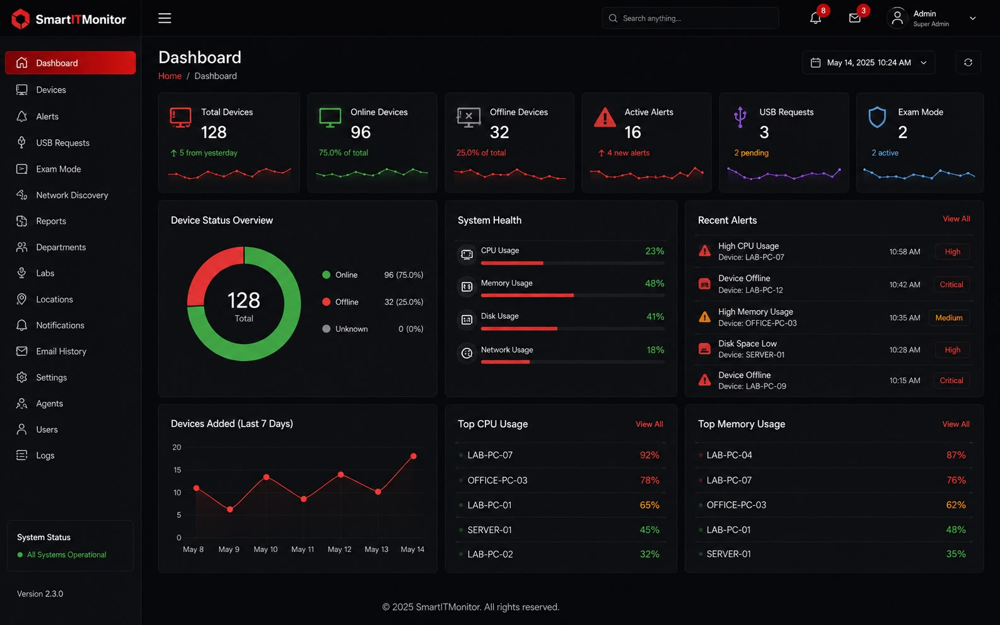
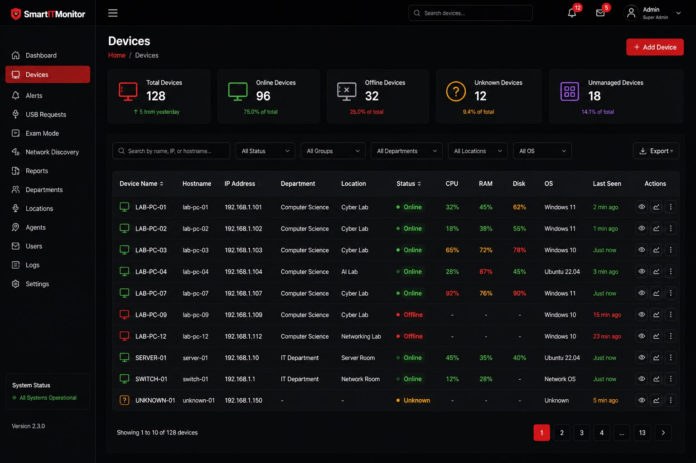
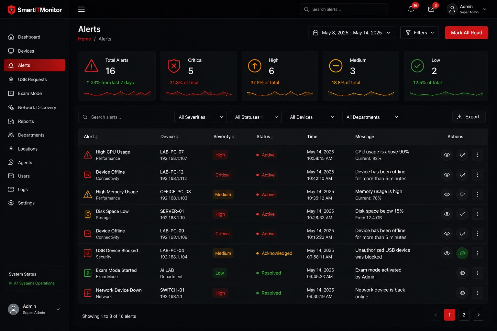

# 🚀 Smart IT Monitor

<p align="center">
<b>Enterprise Real-Time IT Infrastructure Monitoring Platform</b>
</p>

Smart IT Monitor is a full-stack monitoring platform for managing devices, collecting system metrics, monitoring infrastructure health, and handling alerts in real time.

---

# 📌 Overview

Smart IT Monitor provides a centralized dashboard to monitor IT infrastructure using modern web technologies.

The platform supports:

- Real-time device monitoring
- CPU, RAM and Disk tracking
- Device health monitoring
- Alert management
- Telegram alert notifications
- WebSocket live updates
- Network discovery
- USB approval workflow
- Exam mode enforcement
- Web Access Control (allow/block domain policies)
- Software deployment (agent-managed packages)
- Endpoint activity monitoring
- OS deployment orchestration
- Infrastructure analytics
- Containerized deployment

---

# ✨ Features

## 🖥 Device Monitoring

- Device registration
- Device status tracking
- Online/offline detection
- Heartbeat monitoring
- CPU monitoring
- RAM monitoring
- Disk monitoring


## 📊 Dashboard

- Total devices overview
- Online devices
- Offline devices
- Performance statistics
- Alert analytics
- Real-time updates


## 🚨 Alert System

- Automatic alert creation
- Alert severity management
- Alert history
- Open and resolved states
- Per-device/per-type alert cooldown (prevents alert storms)
- Automatic resolution when the metric recovers
- `resolved_at` tracking on alerts
- Manual resolve endpoint for admins
- Telegram alert notifications


## 🌐 Network Discovery

- LAN host discovery (nmap)
- Automatic discovery submission from agents
- Managed / unmanaged device tracking
- Device approval flow


## 🔌 USB Approval

- USB connect/disconnect event detection
- Admin approval requests
- Approve / reject decision workflow
- Policy-driven access control


## 📝 Exam Mode

- Global exam mode toggle
- USB policy enforcement (`approval_required`)
- Managed-lab policy integration


## 🌐 Web Access Control

- Admin-managed allow/blocklist domain policies
- Targets: all devices, department, lab, location, or specific device/group
- Agent-side enforcement via the OS hosts file (`allowlist.conf`)
- Live sync status (`synced` / `pending` / `failed`) per device with versioning
- Real-time updates via WebSocket `web_access_update` events


## 📦 Software Deployment

- Admin-managed packages (`.exe`/`.msi`) with compatibility matrix (OS/arch)
- Deploy / uninstall commands with approval workflow
- Device group targeting
- Agent-side install/uninstall with progress reporting
- Real-time updates via WebSocket `software_update` events


## 🛰 Endpoint Activity

- Agent-collected activity events (process/app, network, filesystem, URL)
- Configurable upload cadence pushed to agents
- Real-time updates via WebSocket `activity_update` events


## 💿 OS Deployment

- OS image library with sha256/sha1 checksums
- Admin approval workflow (deployments blocked until the image is approved)
- Target selection: all managed computers, department, lab, location, or selected devices
- Deployment lifecycle: `PENDING` → agent accept → provisioning handoff → `INSTALLING` → `COMPLETED`
- Offline-target handling and per-deployment `FAILED` states with reasons
- Checksum verification against the image store before handoff
- PXE configuration payload generation (kernel, initrd, kickstart URL)
- Automatic retry for pending deployments
- Deployment audit log and live status via WebSocket `deployment_update` events
- Agent-side endpoints to fetch and acknowledge pending deployments


## 🔐 Security

- JWT authentication
- Protected API routes
- Device agent token validation
- Role-based access control


## ⚡ Real-Time Updates

- WebSocket communication
- Live metric broadcasting
- Instant dashboard updates

---

# 🏗 Architecture

```
                 Users

                   |

                   |

            React Dashboard

                   |

                   |

            FastAPI Backend

                   |

        -------------------------

        |                       |

 PostgreSQL Database     WebSocket Server

        |

        |

 Monitoring Agents

        |

        |

 CPU / RAM / Disk Metrics
```

---

# 🛠 Tech Stack

## Frontend

- React.js
- Vite
- Tailwind CSS
- Axios
- WebSocket


## Backend

- Python
- FastAPI
- SQLAlchemy
- JWT
- Uvicorn


## Database

- PostgreSQL


## Monitoring

- Prometheus
- Grafana


## Deployment

- Docker
- Docker Compose

---

# 📂 Project Structure

```
SmartITMonitor/

├── backend/
│   ├── app/
│   │   ├── routers/          # API route modules
│   │   └── services/         # alert/notification/heartbeat services
│   ├── Dockerfile
│   ├── requirements.txt
│   └── .dockerignore
│
├── frontend/
│   ├── src/                  # React app
│   ├── nginx/default.conf    # reverse proxy for /api and /ws
│   ├── Dockerfile
│   └── package.json
│
├── agent/
│   ├── smartit_agent.py      # metrics agent (env-driven)
│   ├── software_deployment.py # software install/uninstall agent loop
│   ├── web_access.py         # web access (allow/block) enforcement loop
│   ├── monitor.py            # legacy agent (token-based metrics)
│   ├── agent.py              # legacy agent (config.json flow)
│   ├── deploy.sh             # one-command endpoint onboarding (register + env)
│   ├── .agent.env.example    # LAN-tuned agent environment template
│   ├── network/              # LAN discovery module
│   ├── usb/                  # USB event monitor
│   └── run.sh
│
├── monitoring/
│   └── prometheus/prometheus.yml
│
├── screenshots/
├── demo/
├── docker-compose.yml
├── .env.example
├── README.md
└── LICENSE
```

---

# 🚀 Installation

## Clone Repository

```bash
git clone https://github.com/degalapardhiv/SmartITMonitor.git

cd SmartITMonitor
```

---

# 🐳 Docker Deployment

## Build and Start

This is the main deploy path. First, configure the environment
(`cp .env.example .env` and fill it in — see Environment Configuration above).

```bash
docker compose up -d --build
```

On first start the backend seeds the bootstrap admin account
(`ADMIN_USERNAME` / `ADMIN_PASSWORD`) and creates all database tables.

## Access over any interface (wlan0 / eth0 / any NIC)

The stack is **not tied to Docker's localhost**. Every service binds to
`0.0.0.0`, so it answers on **any** network interface the host has up — WiFi
(`wlan0`), Ethernet (`eth0`), etc. The frontend builds its API and WebSocket
URLs from the browser's `window.location`, so nothing is hard-coded to a
specific IP.

After `docker compose up -d`, reach the UI and APIs from any machine on the
LAN using the host's IP for whichever interface is active:

```bash
# find the server IP on the active interface
ip -o -4 addr show | awk '{print $2, $4}'

# then browse to (port 80 for the UI, 8000 for the API/Swagger)
#   http://<SERVER_IP>/          # UI (nginx -> backend, /api + /ws proxied)
#   http://<SERVER_IP>:8000/     # backend + /docs
#   http://<SERVER_IP>:3000/     # Grafana
#   http://<SERVER_IP>:9090/     # Prometheus
```

No changes are needed when switching between `wlan0` and `eth0` — the
published ports (`80`, `8000`, `9090`, `3000`) accept connections on all
interfaces. The WebSocket (`/ws`) is proxied through nginx so real-time
updates work from any host too.

> **CORS**: the production UI is same-origin (nginx), so CORS is not required.
> If you instead run a separate Vite dev server pointed at the API, set
> `CORS_ORIGINS` in `.env` (see `.env.example`).

## Check Containers

```bash
docker ps
```

## Stop Application

```bash
docker compose down
```

## Restart Services

```bash
docker compose restart
```

## Database Backup

```bash
./backup_db.sh
```

Writes a `pg_dump` of the compose database to `backups/` using the
`POSTGRES_USER` / `POSTGRES_DB` values from `.env`.

---

# 🔧 Environment Configuration

Copy the template and fill in real values (never commit `.env`):

```bash
cp .env.example .env
```

Generate a strong `SECRET_KEY`:

```bash
python3 -c "import secrets; print(secrets.token_urlsafe(64))"
```

Paste the result into `SECRET_KEY` in `.env`, then set
`POSTGRES_PASSWORD` and `ADMIN_PASSWORD` to strong values.

```env
# PostgreSQL
POSTGRES_USER=smartadmin
POSTGRES_PASSWORD=change_this_password
POSTGRES_DB=smart_monitor
DATABASE_URL=postgresql://smartadmin:change_this_password@db:5432/smart_monitor

# JWT
SECRET_KEY=<generated-random-string>
ACCESS_TOKEN_EXPIRE_MINUTES=60

# Telegram alert notifications (optional)
TELEGRAM_ENABLED=true
TELEGRAM_BOT_TOKEN=
TELEGRAM_CHAT_ID=

# Bootstrap admin (seeded into the DB on first start)
ADMIN_USERNAME=admin
ADMIN_PASSWORD=change_this_admin_password
```

The `docker-compose.yml` passes `TELEGRAM_*` and `ADMIN_*` to the backend
container, so the admin account and Telegram alerts are configured through
`.env` alone.

### Agent configuration

The monitoring agent reads its settings from `agent/.agent.env` (or the
environment). Example with the LAN-tuned (real-time) defaults:

```bash
SMARTIT_API_URL=http://<server-ip>:8000
SMARTIT_DEVICE_ID=1
SMARTIT_AGENT_TOKEN=<device agent token>

# Metrics heartbeat (seconds) — drives live online/offline status.
SMARTIT_INTERVAL=5

# LAN discovery cadence (seconds).
SMARTIT_NETWORK_DISCOVERY_INTERVAL=60
# Comma-separated ranges to scan beyond the agent's own subnet/VLAN.
# Required when endpoints span multiple subnets behind the switches.
SMARTIT_NETWORK_RANGES=10.0.0.0/24,192.168.1.0/24

# OS deployment poll (seconds) and reboot command for PXE handoff.
SMARTIT_DEPLOYMENT_POLL_INTERVAL=15
# SMARTIT_REBOOT_CMD=systemctl reboot

# Endpoint activity / software deployment / web access cadence (seconds).
SMARTIT_ACTIVITY_INTERVAL=30
SMARTIT_SOFTWARE_POLL_INTERVAL=30
SMARTIT_WEB_ACCESS_POLL_INTERVAL=15
```

The agent runs a metrics loop (heartbeats + CPU/RAM/Disk submission) and, in a
separate daemon thread, periodically runs LAN host discovery via `nmap` and
submits the results to `POST /network/discovery`. Both loops are env-driven.

**Admin-pushed settings:** Agents also poll `GET /agent/config` (60s cadence)
and apply whatever an admin configures under **Settings > Agent Configuration**
— server URL, network ranges, all polling intervals, the PXE reboot command,
and default department/lab/location. Server values override the local
`.agent.env`, so you can retarget a fleet without touching each machine.

### Onboarding endpoints (deploy.sh)

Run once on every monitored endpoint to register it and write a tuned
`agent/.agent.env`:

```bash
./agent/deploy.sh http://<server-ip>:8000 --service
```

`--service` also installs and starts a `systemd` unit (`smartit-agent`).
Devices can also self-register manually through `POST /agent/register`, which
returns the `device_id` and `agent_token` to use.

Install the agent deps and start it manually with:

```bash
python3 -m venv .venv-agent
.venv-agent/bin/pip install -r agent/requirements.txt
./agent/run.sh
```

---

# 🌐 Services

## Frontend Dashboard

```
http://localhost
```

## Backend API

```
http://localhost:8000
```

## API Documentation

```
http://localhost:8000/docs
```

## Grafana

```
http://localhost:3000
```

## Prometheus

```
http://localhost:9090
```

---

# 🔌 API Endpoints

## Authentication

```
POST /auth/register      (admin or first-user bootstrap)
POST /auth/login         (returns JWT)
POST /auth/change-password
```


## Devices

```
GET    /devices                    (authenticated)
GET    /devices/{id}               (authenticated)
POST   /devices                    (admin)
PUT    /devices/{id}               (admin)
DELETE /devices/{id}               (admin)
GET    /devices/{id}/metrics       (authenticated)
POST   /devices/{id}/metrics       (agent — X-Agent-Token header)
POST   /agent/register             (agent self-registration)
```


## Network Discovery

```
POST /network/discovery       (agent — X-Agent-Token header)
GET  /network/devices         (authenticated)
GET  /network/summary         (authenticated)
POST /network/devices/{id}/managed   (admin)
```


## USB Approval

```
POST /usb/events                  (agent — X-Agent-Token header)
GET  /usb/requests                (authenticated)
POST /usb/requests/{id}/decision  (admin)
```


## Exam Mode

```
GET /exam-mode        (authenticated)
PUT /exam-mode        (admin)
```


## Web Access Control

```
POST   /web-access/policies                     (admin)
GET    /web-access/policies                     (admin)
GET    /web-access/policies/{id}                (admin)
PUT    /web-access/policies/{id}                (admin)
DELETE /web-access/policies/{id}                (admin)
POST   /web-access/policies/{id}/domains        (admin)
DELETE /web-access/policies/{id}/domains/{id}   (admin)
POST   /web-access/policies/{id}/targets        (admin)
DELETE /web-access/policies/{id}/targets/{id}   (admin)
GET    /web-access/policies/{id}/devices        (admin)
GET    /web-access/sync-logs                    (admin)
GET    /web-access/stats                        (admin)
GET    /web-access/agent/policy                 (agent — X-Agent-Token header)
POST   /web-access/agent/sync-result            (agent — X-Agent-Token header)
```


## Software Deployment

```
GET    /software/packages                          (authenticated)
POST   /software/packages                          (admin)
PUT    /software/packages/{id}                     (admin)
POST   /software/packages/{id}/approve             (admin)
DELETE /software/packages/{id}                     (admin)
GET    /software/packages/{id}/download            (agent)

GET    /software/groups                            (authenticated)
POST   /software/groups                            (admin)
PUT    /software/groups/{id}                       (admin)
POST   /software/groups/{id}/members               (admin)
DELETE /software/groups/{id}/members               (admin)

GET    /software/preview                           (admin)
POST   /software/deployments                       (admin)
GET    /software/deployments                       (authenticated)
GET    /software/deployments/{id}/events           (authenticated)
POST   /software/deployments/{id}/cancel           (admin)
GET    /software/inventory                         (authenticated)

POST   /software/agent/device-info                 (agent)
GET    /software/agent/work                        (agent)
GET    /software/agent/download/{target_id}        (agent)
POST   /software/agent/status                      (agent)
POST   /software/agent/result                      (agent)
POST   /software/agent/inventory                   (agent)
```


## OS Deployment

```
GET    /os-images                         (authenticated)
POST   /os-images                         (admin)
PUT    /os-images/{id}                    (admin)
DELETE /os-images/{id}                    (admin)
POST   /os-images/{id}/verify-checksum    (authenticated)

GET    /deployments                       (authenticated)
GET    /deployments/summary               (authenticated)
GET    /deployments/audit                 (authenticated)
POST   /deployments                       (admin — image must be approved)
POST   /deployments/{id}/retry            (admin)
GET    /deployments/agent/pending         (agent — X-Agent-Token header)
POST   /deployments/{id}/agent-ack        (agent — X-Agent-Token header)
```

Deployments target devices by `target_type` (`all`, `department`, `lab`,
`location`, `selected`). Approved images are verified against the configured
`SMARTIT_IMAGE_DIR` store before the PXE provisioning handoff
(`SMARTIT_PXE_DIR`).


## Alerts

```
GET    /alerts                  (authenticated)
GET    /alerts/history          (authenticated)
GET    /alerts/analytics        (authenticated)
DELETE /alerts/cleanup          (admin — purges resolved alerts older than 30 days)
PATCH  /alerts/{id}/resolve     (admin — manual resolve, sets resolved_at)
```

Alert thresholds are evaluated on every metrics submission. When a metric
recovers (drops back below threshold), all open alerts for that device/metric
are automatically resolved and a WebSocket `alert_resolved` event is broadcast.


## Dashboard

```
GET /dashboard
```


## Monitoring

```
GET /metrics    (Prometheus scrape target)

GET /health
```

---

# 📡 WebSocket

Endpoint:

```
/ws
```

Used for (all broadcast live, with automatic client reconnection):

- Live device updates (`device_update`) and online/offline (`device_online` / `device_offline`, `device_deleted`)
- Metric broadcasting
- Alert creation (`alert`) and automatic resolution (`alert_resolved`)
- OS deployment status updates (`deployment_update`)
- Software deployment updates (`software_update`)
- Web Access Control changes (`web_access_update`)
- Endpoint activity (`activity_update`)
- Threat events (`threat_detected` / `threat_update`)
- Camera / lab alerts
- Notification history (`notification`)
- Settings changes (`settings_changed`)
- Dashboard refresh events

---

# 📊 Monitoring Workflow

```
Device Agent

     |

Collect Metrics

     |

FastAPI Backend

     |

PostgreSQL Database

     |

WebSocket Update

     |

React Dashboard
```

## 📸 Screenshots

### Dashboard

The SmartITMonitor dashboard provides a centralized real-time overview of the IT infrastructure, including device health, online/offline status, active alerts, USB requests, Exam Mode status, system health, and recent activity.



---

### Devices

The Devices page provides centralized device management with device status, IP address, hostname, department, location, CPU, RAM, disk usage, operating system, and last-seen information.



---

### Alerts

The Alerts section provides centralized monitoring of system and security events, including severity, affected device, status, timestamp, alert message, and administrative actions.



---

# 🧪 Testing

## Backend (pytest)

Run the backend test suite (uses the Docker database via the `db_session`
fixture — do not run against a stale local Postgres schema):

```bash
cd backend
./venv/bin/python -m pytest tests/ -q
```

Covers auth, devices, alerts (including auto-resolve on recovery), network
discovery, USB approval, exam mode, OS deployment (images, lifecycle, agent
handshake, and provisioning), software deployment, web access control,
endpoint activity, cameras, settings, and threat protection.

## Frontend (smoke tests)

```bash
cd frontend
npm install
npm run smoke   # runs frontend/smoke-test.mjs
npm run lint    # eslint (0 warnings expected)
npm run build   # production build
```

---

# 👥 Team Collaboration

| Member | GitHub | Role |
|---|---|---|
| Degala Pardhiv | https://github.com/degalapardhiv | Full Stack Development, Architecture, Deployment |
| K Maruthi Srikar | https://github.com/kmaruthisrikar | Frontend Development, UI/UX |
| Srinidhi | https://github.com/srinidhi-06-m | Backend Development, Database, Monitoring |

---

# ✅ Completion Checklist

- [x] React dashboard completed
- [x] FastAPI backend completed
- [x] PostgreSQL database integrated
- [x] JWT authentication completed
- [x] Device monitoring completed
- [x] WebSocket updates completed
- [x] Alert system completed
- [x] Prometheus integration completed
- [x] Grafana monitoring completed
- [x] Docker deployment completed
- [x] Alert cooldown and auto-resolve on recovery completed
- [x] Agent-side network discovery integration completed
- [x] Backend test suite completed (151 tests)
- [x] Frontend smoke tests + lint completed
- [x] Web Access Control completed
- [x] Software deployment completed
- [x] Real-time LAN tuning (switch environment) completed
- [x] Documentation completed

---

# 🚀 Future Improvements

- Mobile application
- AI anomaly detection
- Cloud deployment
- Kubernetes support

---

# 📄 License

MIT License

---

# 👨‍💻 Author

## Degala Pardhiv

GitHub:
https://github.com/degalapardhiv

Project:
https://github.com/degalapardhiv/SmartITMonitor

---

Built with ❤️ by Smart IT Monitor Team
